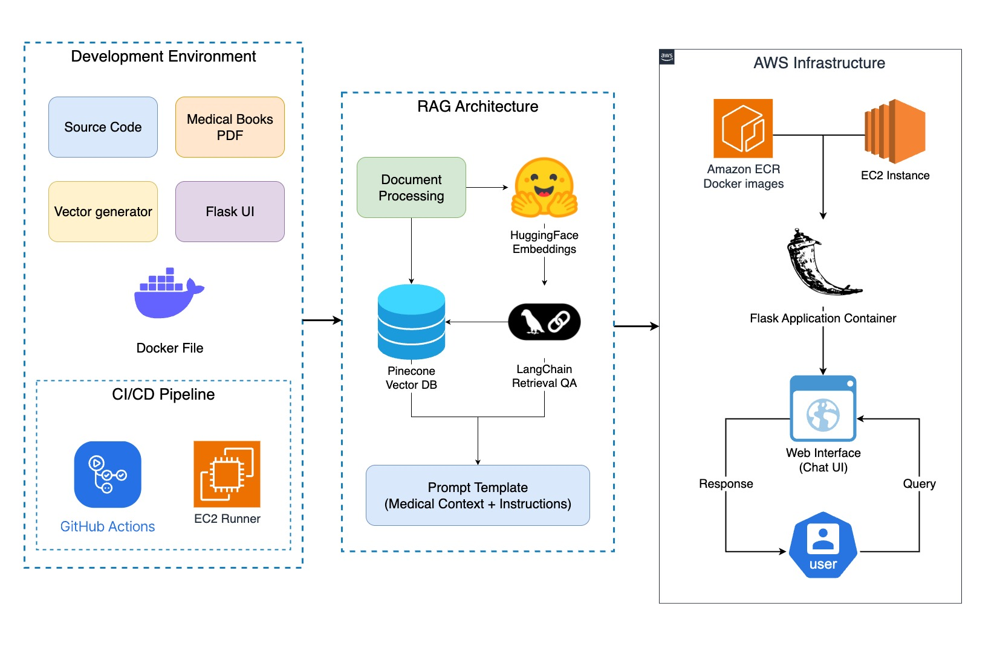
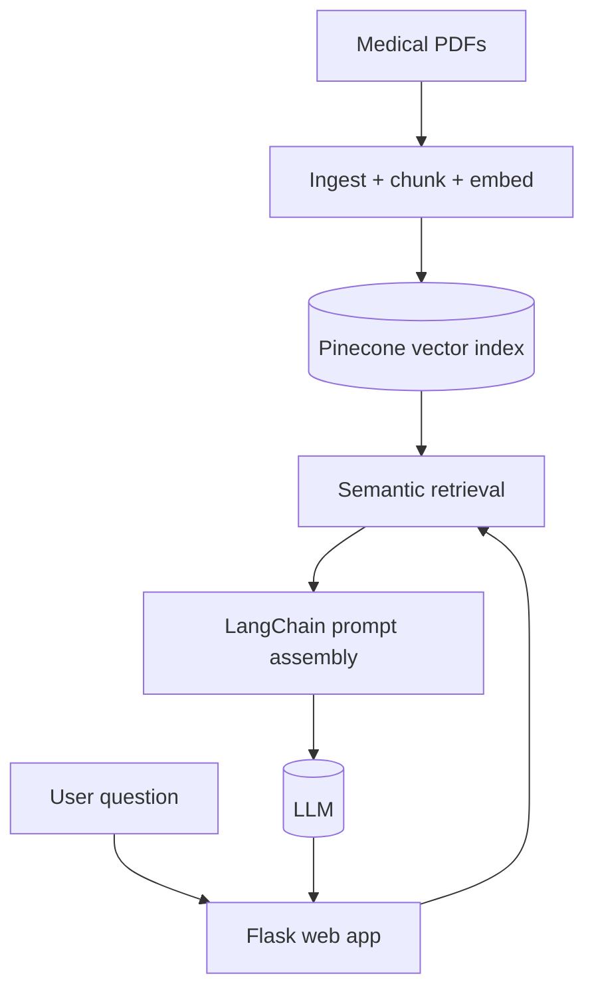
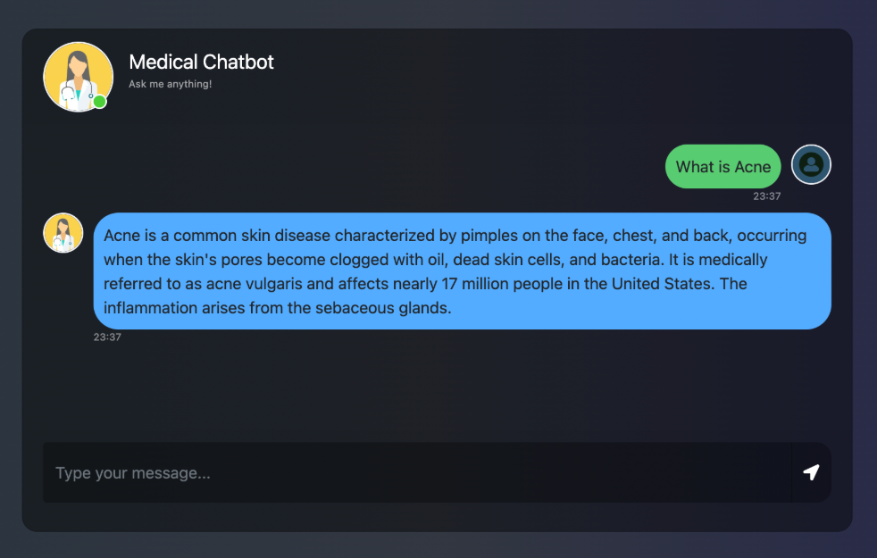

# Medical Chatbot with RAG Architecture

Production-oriented medical question-answering chatbot built with a Retrieval-Augmented Generation (RAG) pipeline.  
The application ingests medical PDF content, indexes it in a vector database, and serves grounded responses through a Flask web interface.

## Overview

This project demonstrates an end-to-end RAG system:
- document loading and chunking
- embedding generation
- vector retrieval from Pinecone
- prompt orchestration with LangChain
- response generation via an LLM
- containerized deployment to AWS using GitHub Actions

## Architecture



### Architecture (Mermaid)



High-level components:
1. **Data Pipeline**: Processes source PDFs and stores vector embeddings.
2. **Inference Layer**: Retrieves relevant context and generates grounded answers.
3. **Application Layer**: Flask-based web chat interface.
4. **Deployment Layer**: Docker + CI/CD + AWS (ECR/EC2).

## App Screenshot



## Core Features

- **RAG workflow** for context-aware, citation-style answering from ingested documents
- **Semantic retrieval** via Pinecone vector search
- **LLM integration** through LangChain-compatible model interface
- **Web UI** for multi-turn conversational interaction
- **Containerized runtime** for consistent local and cloud deployment
- **CI/CD automation** using GitHub Actions

## Tech Stack

- **Language**: Python 3.9+
- **LLM/RAG**: LangChain, Hugging Face embeddings, Llama-family model
- **Vector DB**: Pinecone
- **Web Framework**: Flask
- **Infra/DevOps**: Docker, GitHub Actions, AWS ECR, AWS EC2

## Prerequisites

- Python 3.9+
- Docker
- Pinecone API key
- Hugging Face API token
- AWS account with permissions for ECR and EC2 (for cloud deployment)

## Local Setup

### 1) Clone repository
```bash
git clone <your-repository-url>
cd Medical-Chatbot-with-RAG-Architecture
```

### 2) Install dependencies
```bash
pip install -r requirements.txt
```

### 3) Configure environment variables
Create a `.env` file in the project root:
```env
PINECONE_API_KEY=your_pinecone_api_key
PINECONE_INDEX_NAME=medicalbot
HUGGINGFACE_API_TOKEN=your_huggingface_token
```

### 4) Build vector index
```bash
python store_index.py
```

### 5) Run the application
```bash
python app.py
```

App endpoint: `http://localhost:8080`

## Docker

### Build image
```bash
docker build -t medical-chatbot .
```

### Run container
```bash
docker run -p 8080:8080 --env-file .env medical-chatbot
```

## AWS Deployment (ECR + EC2)

### 1) Configure AWS CLI
```bash
aws configure
```

### 2) Create ECR repository
```bash
aws ecr create-repository --repository-name medical-chatbot
```

### 3) Push Docker image to ECR
```bash
aws ecr get-login-password --region <aws-region> | docker login --username AWS --password-stdin <account-id>.dkr.ecr.<aws-region>.amazonaws.com
docker tag medical-chatbot:latest <account-id>.dkr.ecr.<aws-region>.amazonaws.com/medical-chatbot:latest
docker push <account-id>.dkr.ecr.<aws-region>.amazonaws.com/medical-chatbot:latest
```

### 4) Run on EC2
- Provision an EC2 instance.
- Install Docker.
- Pull image from ECR and run with environment variables.

## CI/CD Workflow

The GitHub Actions pipeline is structured to:
1. trigger on code changes
2. build the Docker image
3. run tests/checks
4. publish image to ECR
5. deploy updated container to EC2

## Project Structure

```text
Medical-Chatbot-with-RAG-Architecture/
├── app.py
├── helper.py
├── store_index.py
├── prompt.py
├── requirements.txt
├── Dockerfile
├── templates/
│   └── chat.html
├── static/
│   └── style.css
├── data/
│   └── medical_book.pdf
├── .github/
│   └── workflows/
│       └── main.yml
└── README.md
```

## Testing

```bash
python -m pytest tests/
```

## Notes

- This project is intended for educational and technical demonstration purposes.
- Responses generated by the chatbot should not be treated as clinical diagnosis or medical advice.

- Bump the CI image to use the latest stable runner version

- Simplify the main loop by extracting request handling into a dedicated function

- Update the license file and add the new third-party notices

- Refactor config loading into a separate module for better testability

- Improve the error recovery when the database connection is lost

- Adjust buffer size for the stream reader to reduce memory usage

- Update the example config with all available options and comments

- Add a note in the README about the breaking change in 2.0

- Implement request ID propagation for better tracing across services

- Update README with installation steps and environment variable documentation

- Refactor the client to use async context manager for the session
